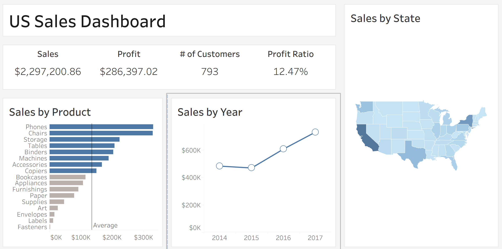

# Business-Performance-Dashboard-US-Sales

## 📋 Project Overview
A data visualization project showcasing **business performance** insights through an interactive Tableau dashboard using the **Kaggle Sample Superstore dataset**.
The dashboard consolidates key metrics — **Sales**, **Profit**, **Number of Customers**, and **Profit Ratio** — and enables **dynamic exploration** by product category, state, and year through integrated interactive filters.

---
## 🖼️ Dashboard Preview

---

## 🎯 Objectives
- Visualize and track business performance using key sales metrics.  
- Identify top-performing products and states.  
- Evaluate year-over-year sales growth and profitability.  
- Demonstrate expertise in interactive dashboard design and analytical storytelling.

---

## 📊 Key Insights
- 📈 **Sales Growth:** Continuous increase in annual sales from 2014–2017.  
- 💰 **Top Products:** Phones and Chairs are the highest revenue contributors.  
- 🗺️ **Regional Performance:** California, New York, and Texas lead in total sales.  
- ⚙️ **Profitability:** Overall profit ratio of **12.47%**, suggesting scope for margin optimization.

---

## ⚙️ Process

### 1. Data Source
- <a href="https://github.com/fretaabrish/Business-Performance-Dashboard-US-Sales/blob/main/Sample-Superstore.csv"> Kaggle – *Sample Superstore Dataset*</a>

### 2. Data Preparation
- Cleaned and structured dataset using **Python (Pandas)**.  
- Standardized columns, verified data types, and removed inconsistencies.

### 3. Dashboard Development
- Designed KPIs for **Sales**, **Profit**, **Profit Ratio**, and **Customer Count**.  
- Created visuals for:
  - Sales by Product *(Horizontal Bar Chart)*  
  - Sales by Year *(Line Chart)*  
  - Sales by State *(Geographical Map)*  
- Integrated **interactive filters** for product category, region, and year to allow customized data exploration.

---

## 🛠️ Tools & Technologies
- **Visualization:** Tableau  
- **Data Preparation:** Python (Pandas, NumPy)  

---

## 📈 Results
- Built a clean, intuitive dashboard offering **real-time filtering and exploration**.  
- Delivered **multi-dimensional business insights** that support strategic decisions.  
- Demonstrated strong **data visualization** and **UI/UX design** capabilities.

---

## 💡 Skills Demonstrated
- Data Wrangling and Cleaning  
- KPI Computation and Business Metric Design  
- Interactive Dashboard Development  
- Analytical Storytelling  
- Visualization Best Practices  

---

## 🧩 How to Use
1. Open the Tableau workbook (`US_Sales_Dashboard.twbx`) or view it on Tableau Public.  
2. Use filters to explore performance by **product category**, **state**, and **year**.  
3. Hover over visuals for detailed tooltips and interactive comparisons.

---
## 📚 Dataset Reference
Kaggle: [Sample Superstore Dataset](https://www.kaggle.com/datasets/juhi1994/superstore)

---

## 🚀 Future Enhancements
- Integrate **profit and sales forecasting** using time-series models (ARIMA or Prophet).  
- Add **customer segmentation** and **market basket analysis**.  
